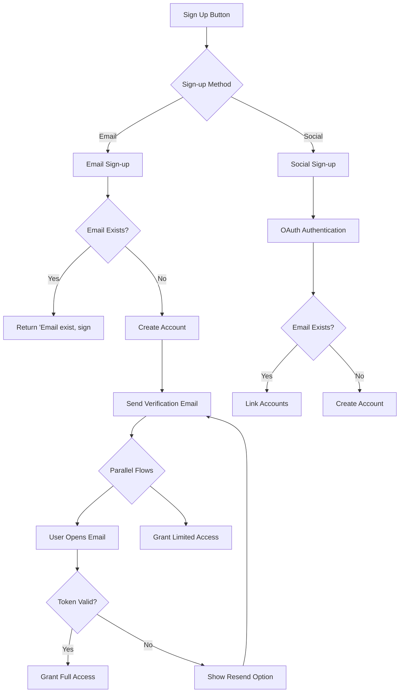

## Press Cmd + Shift + V to open the preview in a new tab

# Sign Up Process

```mermaid
graph TD
    Start[Sign Up Button] --> Choice{Sign-up Method}

    Choice -->|Email| EmailFlow[Email Sign-up]
    Choice -->|Social| SocialFlow[Social Sign-up]

    EmailFlow --> CheckEmail{Email Exists?}
    CheckEmail -->|Yes| ExistingAccount[Return 'Email exist, sign]
    CheckEmail -->|No| CreateAccount[Create Account]

    CreateAccount --> SendVerification[Send Verification Email]

    SendVerification --> ParallelFlow{Parallel Flows}

    ParallelFlow --> EmailClient[User Opens Email]
    ParallelFlow --> LimitedAccess[Grant Limited Access]

    EmailClient --> ValidateToken{Token Valid?}
    ValidateToken -->|Yes| FullAccess[Grant Full Access]
    ValidateToken -->|No| ResendOption[Show Resend Option]
    ResendOption --> SendVerification

    SocialFlow --> OAuthFlow[OAuth Authentication]
    OAuthFlow --> CheckSocialEmail{Email Exists?}
    CheckSocialEmail -->|Yes| LinkAccounts[Link Accounts]
    CheckSocialEmail -->|No| CreateSocialAccount[Create Account]

```
